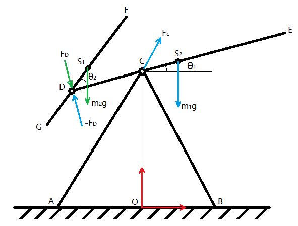

In this work, I used the Newton-Euler method and the Lagrange method to mechanically model and simulate the two-degree-of-freedom chaotic pendulum, and the consistency of the two methods also verified the correctness of the two methods. Secondly, I optimizes the pendulum length by Matlab's own function fmincon and the enum method based on area division, so that the swing time is the longest. Finally, in the case of optimal pendulum length, I studied the effect of damping on the oscillation time.

1. Newtonian-Euler method
   I first performed kinematic analysis of the mechanism, and then through the force analysis, the dynamic equations were written in columns, and according to the termination conditions, the solution and simulation were carried out by using Matlab.
2. Lagrange method
   I first determined the generalized coordinates according to the characteristics of the mechanism, conducted kinematic analysis to obtain the kinetic energy and potential energy of the system, and since the system was a non-conservative system, the Ruili dissipation function was introduced to obtain the generalized force of the system. The Equations of the Second Class of Lagrange are substituted and solved and simulated using Matlab according to the termination condition.
3. Pendulum length optimization
   I first used Matlab's own function fmincon to solve, and found that the solution result was not ideal, because fmincon could only solve the local optimal solution, relying on the selection of the initial value. Secondly, based on the regional division, the two-traversal enumeration method optimizes the pendulum length, and obtains results with considerable credibility, but the time complexity is high.
4. Damping effects
   Through the enumeration method of two iterations, I studies the effect of damping on the pendulum length, and obtains the conclusion that the damping affects both sides, that is, it is possible to increase the oscillation time and shorten the oscillation time, which needs to be analyzed in combination with specific problems.

**Keywords: two-degree-of-freedom chaotic pendulum, Newton-Euler method, Lagrange method, discrete optimization**

---

**Newtonian-Euler method**

$$
\begin{aligned}
&D E:\left\{\begin{array}{l}
m_1 g+F_C-F_D=m_1 a_{S_2} \\
r_{S_2 C} \times F_C-r_{S_2 D} \times F_D-c_1 \dot{\theta}_1+c_2 \dot{\theta}_2=J_1 \ddot{\theta}_1
\end{array}\right. \\
&G F:\left\{\begin{array}{l}
m_2 g+F_D=m_2 a_{S_1} \\
r_{S_1 D} \times F_D-c_2 \dot{\theta}_2=J_2\left(\ddot{\theta}_1+\ddot{\theta}_2\right)
\end{array}\right.
\end{aligned}
$$

---

**Lagrange method**

$$
\left[ \begin{array}{*{35}{l}}
   {{J}_{11}} & {{J}_{12}}  \\
   {{J}_{12}} & {{J}_{22}}  \\
\end{array} \right]\left[ \begin{array}{*{35}{l}}
   \overset{..}{\mathop{{{\theta }_{1}}}}\,  \\
   \overset{..}{\mathop{{{\theta }_{2}}}}\,  \\
\end{array} \right]=\left[ \begin{array}{*{35}{l}}
   {{F}_{1}}-\left( \frac{1}{2}\frac{\partial {{J}_{11}}}{\partial {{\theta }_{1}}}\dot{\theta }_{1}^{2}+\frac{\partial {{J}_{11}}}{\partial {{\theta }_{2}}}{{{\dot{\theta }}}_{1}}\overset{.}{\mathop{{{\theta }_{2}}}}\,+\left( \frac{\partial {{J}_{12}}}{\partial {{\theta }_{2}}}-\frac{1}{2}\frac{\partial {{J}_{22}}}{\partial {{\theta }_{1}}} \right)\dot{\theta }_{2}^{2} \right)  \\
   {{F}_{2}}-\left( \frac{1}{2}\frac{\partial {{J}_{22}}}{\partial {{\theta }_{2}}}\dot{\theta }_{2}^{2}+\frac{\partial {{J}_{22}}}{\partial {{\theta }_{1}}}\overset{.}{\mathop{{{\theta }_{1}}}}\,\overset{.}{\mathop{{{\theta }_{2}}}}\,+\left( \frac{\partial {{J}_{12}}}{\partial {{\theta }_{1}}}-\frac{1}{2}\frac{\partial {{J}_{11}}}{\partial {{\theta }_{2}}} \right)\dot{\theta }_{1}^{2} \right)  \\
\end{array} \right]
$$

---

##### **Pendulum length optimization**

<video src="Design.mp4" controls="yes">

