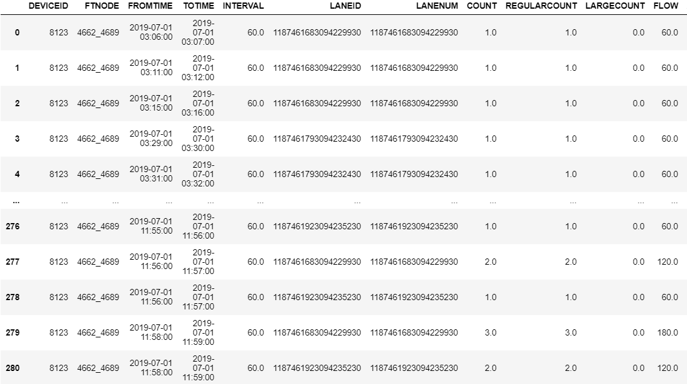
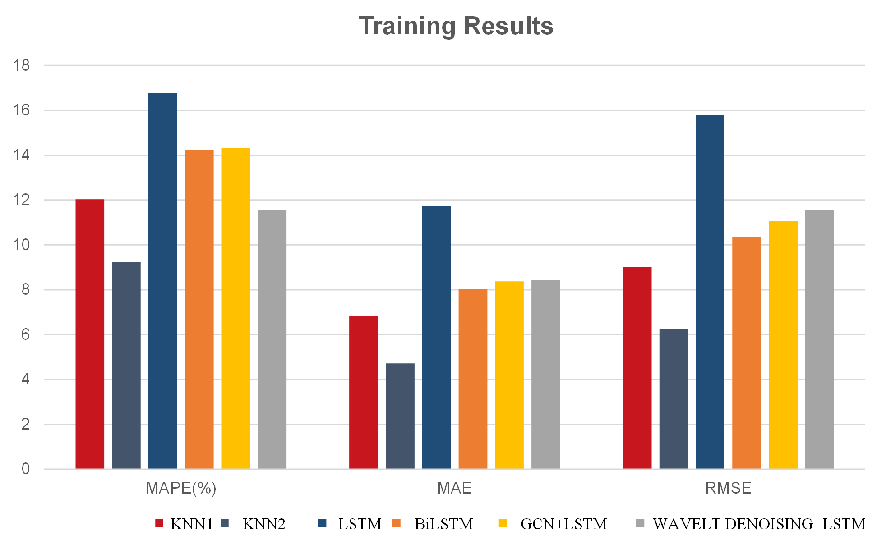

---

We sometimes forget that besides glacier melting and a rising number of extreme weather events, ocean warming is also a result of global warming. We sometimes forget that animals, just like human beings, are making all their efforts to face climate change. Scottish herring and mackerel are two examples of those struggling animals. They migrate to survive.

We try to understand and predict the behaviors of the two species and then dig on the impacts of those behaviors on small fishing companies.

First, we study the temperature changes that will take place on surface seawater of the North Sea in the next 50 years by **establishing the Ocean Temperatures Predicting Model**. We only focus on the temperature changes in the next 50 years during reproduction months of the two species, which are May and June, August and September. Using Grey Forecasting Model, we get the data and draw two figures to show all the temperature changes. It is the basis of all the following analysis.

Second, we establish **the Fishery Location-Temperature Model** to find the possible locations of Scottish herring and mackerel fisheries. We take **Artificial Fish Swarms Algorithm** for reference. Virtualizing the real fish individual, we simulate the swarming of real fish when purchasing a better temperature for reproduction.

Third, based on the location we predict, we establish the **Optimization Fishing Model** to figure out a way out for Scottish small fishing companies in trouble. We begin with analyzing changes in the net profit of those companies in the next 50 years. The result turns out that around the year 2037, the net profit will be zero. Their companies will be fine, in the best case until year 2040 and in the worst case until year 2035. What's more, based on the portfolio model, we identify multiple investment choices of different vessels and locations of branch companies. We find the optimal choice which has the least risk while guaranteeing enough profits. We also consider territorial issues in the problem and find that Scottish small fishing companies have to take reaction, including upgrading their vessels and reallocating their assets to open a branch company. Finally, if a small fishing company operates at a fixed point for 20 years, they should use $85.7 \%$ of the assets for upgrading. If the company chooses to move, then they should allocate the most assets at $100 \mathrm{~km}$ far away from the present location.

In addition, we write a passage for the magazine 'Hook Line and Sinker' to help fishermen tackle the problem. Besides the two suggestions above, we also emphasize the idea of harvest controlling to achieve balance with nature. As we can clearly see when tackling the problem, for all animals including human, there doesn't exist a single winner before climate change.
Keywords: Grey predicting model; Portfolio model;Artificial Fish Swarms Algorithm

**Keywords: Grey predicting model; Portfolio model;Artificial Fish Swarms Algorithmng**

---

**Partial Source Data**

---

**Training Results**

---

**Oral Defense Scene**

