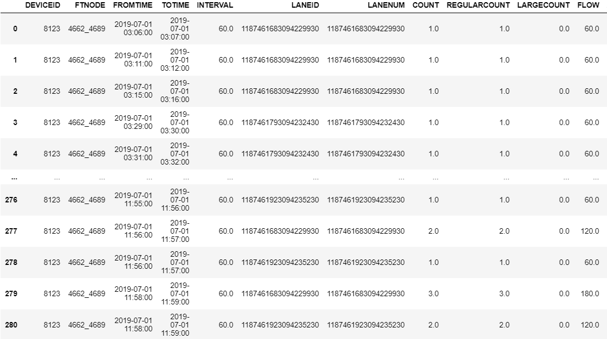
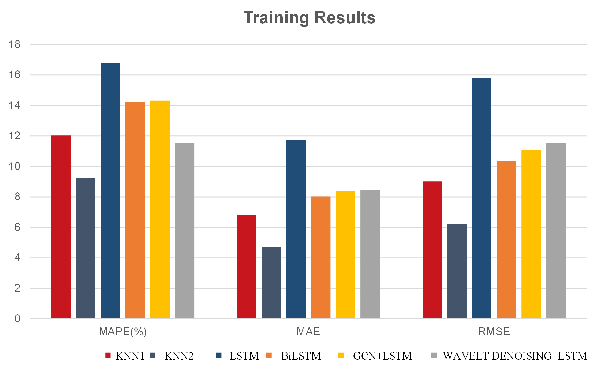

---

With the increasing number of private cars, traffic congestion has become an urgent problem to be solved. This project realizes the use of traffic flow data of past road sections to accurately predict traffic flow data at specific times in the future, which has a guiding effect on the construction of transportation infrastructure.  

According to the OpenTIS platform, lane-level coil data and floating car GPS data for traffic flow in Xuancheng, Anhui Province in July and part of August were obtained. The data was pre-processed, and a time-space KNN model and a GCN &amp;LSTM deep learning method based on the vehicle flow topology map of the road section were established for the coil data, and four control groups of early experimental attempts were set up to demonstrate the innovation and superiority of the first two methods. In the floating car part, through K-means, integer programming and other algorithms, and mathematical modeling, the leap from the floating car data to the overall traffic data of the road section is realized, and this data is used to optimize the road section data measured by the coil.  

For the modeling part of the coil data, this group uses KNN to solve the problem, selects the reciprocal of the European distance to measure the similarity of traffic flow, and determines the weight between the data. Then introduce spatio-temporal similarity, establish a spatiotemporal matrix and use the reciprocal of the matrix F-norm as an indicator to determine the weight. The final training set MAPE result was reduced from 12% to about 9%, and the effect was good, MAE: 4.72, RMSE: 6.24.  

Using the model of GCN LSTM based on the road traffic topology map, this group uses dynamic time-regular DTW to define the similarity of traffic between vehicles, and then establishes the correlation matrix and topology map of vehicle flow between road sections, and then introduces it to GCN LSTM for model training, with the training sets MAPE: 11.55%, MAE: 8.43, RMSE: 17.55. 

Four control groups were introduced, namely BiLSTM under attention mechanism, LSTM after wavelet denoising optimization, LSTM after considering spatiotemporal correlation, and LSTM combined with CNN. For the BiLSTM method, this group entered the Attention mechanism, and the final effect was MAPE: 14.32%, MAE: 8.37, and RMSE: 11.1. For the introduction of wavelet denoising optimization LSTM, the results of the low-frequency part of this group were MAPE: 8.14%, MAE: 4.66, RMSE: 6.53, and the high-frequency part was fitted to MAPE: 14.53%, MAE: 8.04, and RMSE: 10.4. In view of the LSTM after considering the spatial-temporal correlation, this group first proved that there is a correlation in space, and then constructed the correlation coefficient matrix. For the CNN attention BiLSTM model, this group obtained results of MAPE: 11.97%, MAE: 6.76, and RMSE: 8.85.  

For the floating car part, this group preprocessed and visualized the data, used K-Means clustering to process the velocity-density scatterplot, plotted the scatter elbow plot, and finally determined the cluster center after iteration. Further, the group fit the data using the Greenhilltz linear model and the Greenberg logarithmic model. Establishing a model to analyze and predict the relationship between traffic flow density and distance, and using integer programming to solve, and finally predicting the flow of traffic flow, is a powerful supplement and support for coil data.  

Finally, due to the limitation of the competition data, this group chose KNN and GCN &amp;LSTM based on the traffic flow topology of the road section to participate in the pre-submission of the work data, and took the results of GCN &amp; LSTM as the final result. MAPE:24.63%，MAE:8.88，RMSE:11.24。 The group then analyzed the results, compared the models and their advantages and disadvantages, and looked forward to the future application prospects of the project in transportation.  

**Keywords: Big data; Traffic flow forecasting; Space-time KNN; Deep learning; Graph neural networks; Wavelet denoising**

---

**Partial Source Data**

---

**Training Results**

---

**Oral Defense Scene**

